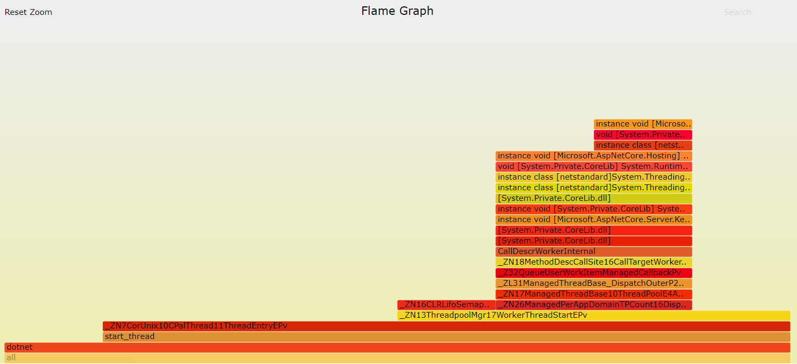

# Quickstart example guide to cpu performance analysis for Golang and .NET Core
CPU performance analysis demo for docker containers using FlameGraphs

VIDEO: [YouTube](https://www.youtube.com/watch?v=ZaKJL9uUiXY)


# Get all the tools

1) Download my perf containers (My desktop repo). You will need the dockerfile and the docker-compose file [here](https://github.com/marcel-dempers/my-desktop/tree/master/dockerfiles/perf/dotnetcore)

Note: You need the dotnet core version of the application you are profiling. Check and adjust the dockerfile accordingly
Change directory to where you downloaded those files and run `docker-compose build` to compile perf tools with dotnetcore SDK

2) Download the flamegraph container
```
docker pull aimvector/flamegraph
```

# Start the sample stack

In this directory of this repo, run

```
docker-compose build
docker-compose up
```

While the stack is running you can profile it with the perf container
# Option 1: Perf

Checkout the `perf` example [here](./perf.md)

# Option 2: eBPF

Checkout the `ebpf` example [here](./ebpf.md)

# KUBERNETES

The same process above works for Kubernetes containers as well.
Instead of docker-compose, you will have to use the `./k8s.yaml` file in this repo that runs the perf container in a pod in your cluster.
Be warned! It's armed with priviledges so use with caution and delete it when done :)

Instead of `docker cp`, you can use `kubectl cp` to copy `out.perf` to your machine where you can run the above flamegraph container.
So therefore the same concept applies in Kubernetes.
